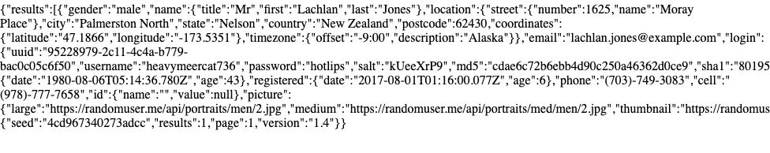
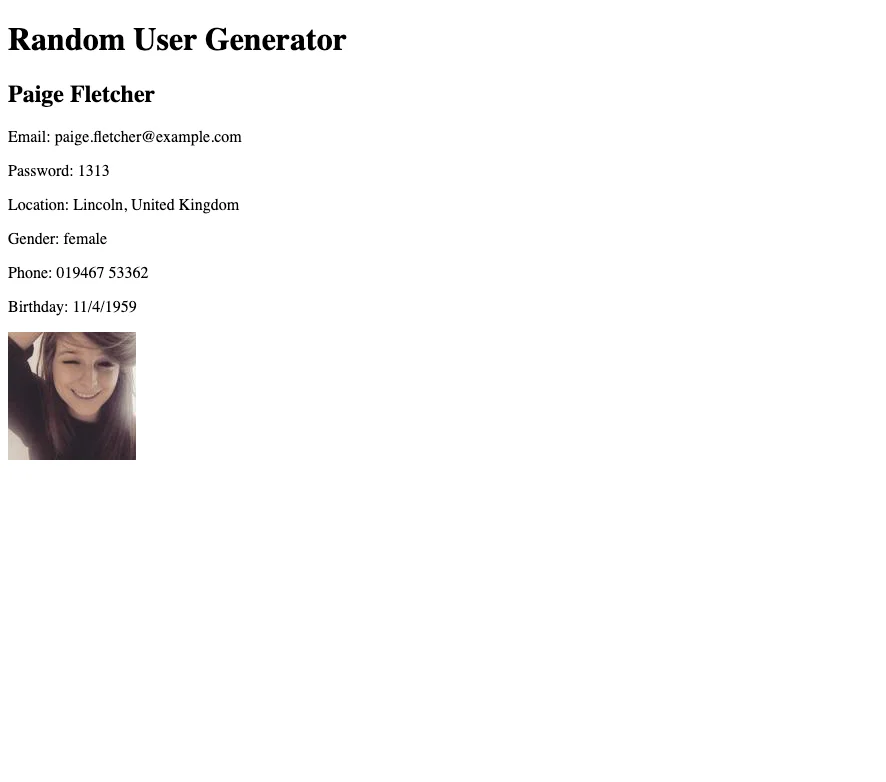
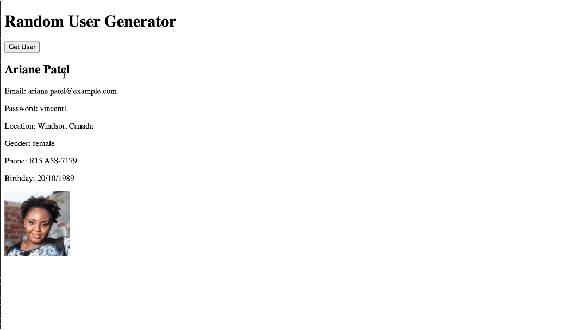

# random user generator

- [random user generator](#random-user-generator)
  - [learning](#learning)
  - [about](#about)
  - [stages](#stages)
    - [1: random user](#1-random-user)
    - [2: clean up the data](#2-clean-up-the-data)
    - [3: get more users](#3-get-more-users)
    - [4: save users](#4-save-users)

## learning
create a web page that can fetch random user data from api for testing purposes and display it on a web page. also, work with promises and handle different data structures.

## about
do you know how developers test their apps with random user data? well, they can use public apis to generate that data, like how they use lorem ipsum for dummy text. creating a web page to display those random user profiles using html and js is a great way to practice working with data and public apis. pretty neat, huh? take this project to find out how you can do it.

## stages
### 1: random user
<details>
<summary>fetch random user info from the api</summary>

#### 1.1 description
let’s start by checking out the [api](https://randomuser.me/api) we’ll use throughout the project. when you click the link, you can see the returned result contains different fields related to a random user. we will use this link to get the information from the api.

check the [api](https://randomuser.me) docs for more information about the api and how to use it, even though it’s pretty straightforward.

in this stage, you need to fetch the data from the api when the page is loaded and display it on the body of the html as is!

you can see that the result is a json object, so turn it into text and put it in the `body`.

ensure that the retrieved data remains unchanged and that nothing else is in the body.

you can also log the fetched json object first to see if you’ve done it correctly.

#### 1.2 objectives
your page should:

1. use the [api](https://randomuser.me);
2. display the data from the api in the body after the page loads;
3. have nothing else in the body.

#### 1.3 examples



</details>

### 2: clean up the data
<details>
<summary>remove the unnecessary information and display the rest on the page</summary>

#### 2.1 description
let's clean up our messy data and use html tags to show the necessary information on the page.

nothing will change in how we get the data, but instead of showing it as is, we'll only use some fields and show them as html tags.

first, add a level 1 `header` to the `body` saying `random user generator`.

second, let’s look at our json object; we are only interested in the `results` key, and you can see that the value is an array. we'll use the first element in the results array.

the information that you need to extract from the result is the following:

- the large picture, first and last names, email, password, city and country, gender, phone, and date of birth.

if you carefully examine the api docs, you can see that you can query specific fields and do it manually.

third, you will show these fields as html elements, so:
- the picture will be an `image` with any `alt` attribute and `class` called `photo`;
- the first and last names will be next to each other, and the tag will be a level 2 `header` with the `name` class;
- the rest of the elements will be `paragraphs`;
- the email will have the text `email:` and the email of the user; the class is `email`;
- the password will have the text `password:` and the password of the user; the class is `password`;
- the gender will have the text `gender:` and the gender of the user; the class is `gender`;
- the phone will have the text `phone:` and the phone of the user; the class is `phone`;
- the location will include the text `location:` followed by a city and a country next to each other. the class is `location`;
- the date of birth will include the text `birthday:` with a date of birth in the following format: `dd/mm/yyyy`; the class is `birthday`.

finally, put all of the elements in a `div` with the class `user` and append it to the html body.

#### 2.2 objectives
your page should:

1. use the [api](https://randomuser.me);
2. display the data from the api in the body after the page loads;
3. have the necessary fields shown in mentioned html tags.

#### 2.3 examples



</details>

### 3: get more users
<details>
<summary>fetch more users when requested and display it as a list on the page.</summary>

#### 3.1 description
having adjusted the data, we can get more users!

in this stage, each click of the button should add a new user to the page, in addition to the first user received upon loading.

first, put a `button` element in the `body` with the text `get user` and the id of `get-user-button`.

after clicking this button we should see the new user in the same way in the previous stage.

this stage should be very simple if you notice that you only need to add a new event related to the button after the load event because the functionality is the same as in the previous stage.

#### 3.2 objectives
your page should:

1. contain a button with the id of `get-user-button` and `get user` text;
2. user the [api](http://randomuser.me/api/)
3. display the data from the api in the body after the page loads;
4. enable the necessary fields shown in mentiond html tags;
5. display a new user after clicking the button.

#### 3.3 examples



</details>

### 4: save users
<details>
<summary>save the fetched users to local or session storage</summary>

#### 4.1 description
it’s good that we can get more random users; now, we should find a way to save them.

in this stage, we will save the data in one of the browser storage types, either session or local. the important thing is that the data should be persistent after a page reload. after saving the users and reloading the page, we should see the saved users.

first, add a `button` element in the `body` with the text `save users` and the id of `save-users-button`.

after clicking this button, save all the fetched users in the storage and show them under the third-level `header` tag with the text `saved users`. the saved users should have the class `saved` added to their container `div` tag.

also, after reloading the page, we should see the saved users similarly.

when saving the users, you should first remove the previously saved users and replace them with the current fetched users.

#### 4.2 objectives
your page should:
1. contain a new button with the id of `save-users-button` and the text `save users`;
2. use the [api](https://randomuser.me/api/);
3. display the data from the api in the body after the page loads;
4. have the necessary fields shown in the mentioned html tags;
5. save and show the fetched users after clicking the button;
6. show a level 3 header with the text `saved users`;
7. show the saved users after the page reloads.

#### 4.3 examples


</details>

[<<](https://github.com/eucarizan/front-end/blob/main/README.md)
<!--
:%s/\(Sample \(Input\|Output\) \d:\)\n\(.*\)/```\r\r**\1**\r```\3/gc

### 0: 
<details>
<summary></summary>

#### 0.1 description

#### 0.2 objectives

#### 0.3 examples


</details>
-->
